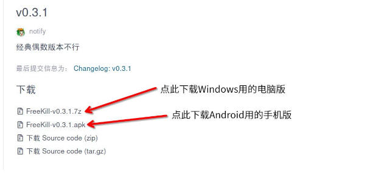

下载和更新新月杀
================

如何下载
---------

新月杀可以在github或者gitee的发行版页面下载。

https://github.com/Qsgs-Fans/FreeKill/releases

https://gitee.com/notify-ctrl/FreeKill/releases

这两个网站按理说是稳定的下载源。不过github可能需要点科技。

如果想要直达某个下载页面，可以在网站后加上 ``/tag/v<版本号>`` ，
这样就直接到了那个版本的下载地址。

比如：

::

  https://gitee.com/notify-ctrl/FreeKill/releases/tag/v0.3.1

接下来以gitee为例讲解如何下载。

进入页面后，网页是这个界面：

   下载页面的说明

点击即可下载。手机版下载的是apk，点进去安装就行；电脑版下载的是7zip压缩包，
先解压缩到某个固定的位置，然后点进去运行FreeKill.exe即可。

注意电脑版一直用同一个文件夹就行了，这和后面讲的更新版本有关。

.. hint::

   新月杀只支持Android 10及以上或者Windows 10及以上！

如何更新
----------

新月杀主要玩法就是依靠服务器联机（后面说明），而联机的基本条件是和服务器
保持版本一致。这就有一个如何更新的问题了。

当无法连接服务器时，屏幕底部会弹出错误信息，有些可能就是提醒你更新：

   版本更新提示

这种情况下，按照前面说的办法下载一个版本符合的新月杀并安装。

.. hint::

   这里应该使用覆盖式安装。手机直接安装新APK就行。电脑的话，将压缩包解压缩后，
   将文件夹复制到原先正在玩的游戏文件夹就行，此谓覆盖式安装。

.. warning::

   如果不进行覆盖式安装的话，你会丢掉所有保存的信息，比如记住的密码、禁将方案等等！
   而且还需要重新下一堆包，因此切记要覆盖文件夹安装！
